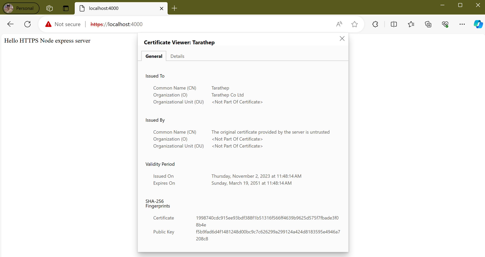

# https-express
HTTPS NodeJS Web Service with Express

## Creating a NodeJS Project

Create exsiting directory or create project

```cmd
mkdir ~/https-express
```

Initialze a new NodeJS project using this command

```cmd
npm init -y
```

## Installing Express

Install the Express package.

```cmd
npm install express
```

## Creating a Web Service

To get started, ensure still in the https-express directory and create new files called ```index.js```. or using command

```cmd
touch index.js
```

edit the ```index.js``` and add the code in below.

```js
const http = require('http');
const fs = require('fs');

const express = require('express');


const app = express();

https.createServer(app).listen(4000, () => {
    console.log('Server is running port 4000');
});

app.get('/',(req,res) => {
    res.send("Hello HTTPS Node express server");
});
```

## Creating SSL Certification (Self-Signed)

step1 generate private key
```cmd
openssl genrsa -out key.pem
```

step2 generate a  certificate service request (CSR) , enter input infomation.

```cmd
openssl req -new -key key.pem -out csr.pem
```

step3 generate public key certificate and sign by private key

```cmd
openssl x509 -req -days 9999 -in csr.pem -signkey key.pem -out cert.pem
```

## Enabling Cert HTTPS in Application

Open the `index.js` file and modify code on import http to https and createServer method, provide the private key (key.pem) and the public key/certificate (cert.pem).

```js
const https = require('https');
const fs = require('fs');

const express = require('express');


const app = express();

https.createServer({
    key: fs.readFileSync("key.pem"),
    cert:fs.readFileSync("cert.pem")
},app).listen(4000, () => {
    console.log('Server is running port 4000');
});

app.get('/',(req,res) => {
    res.send("Hello HTTPS Node express server");
});
```

Test the application in your browser by going to https://localhost:4000.


```cmd
node .\index.js
```

